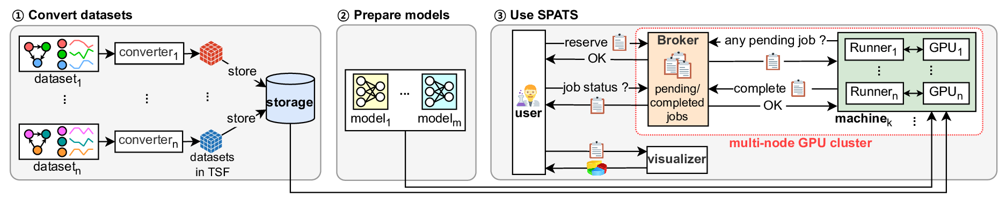

# SPATS



This is the official implementation of "**SPA**tio-**T**emporal graph **S**ystem (SPATS)" in the following paper:

- Yoon, Heeyong, et al. "SPATS: A practical system for comparative analysis of Spatio-Temporal Graph Neural Networks." *Knowledge-Based Systems* ??? (2024): ??????.

## How to use

### Prerequisites

**Note**: This is not a commercial system, so we do not guarantee its behavior in all environments. Please use appropriate external knowledge, official documentation and experiences for handling exceptional cases.

- **Note**: Some parts of the code snippet contains template text; do not copy and paste them directly and make sure replacing the template text appropriately.

1. Prepare your GPU cluster

    a. Make sure the cluster can train machine learning models with multiple GPUs.

    The followings are tested setting:

    - Hardware: More than two nodes (i.e. two computers). Each node is equipped with more than two GPUs.

    - Network: Each node is connected through single 1Gbit Ethernet switch.

    - OS: Each node has `Ubuntu 18.04` installed.

    - Software: `NFS`, and `Python`(3.9); all nodes should have same software stack.

    Of course, for nodes with GPUs, NVIDIA drivers and CUDA must be installed, and CUDA must be compatible with the version of PyTorch you'll be using.

    b. Choose one node as the ***master node***, and choose others as the ***worker node***.

    - If the node has a GPU, you can overlap both roles (***master node*** and ***worker node***)

    c. Download this repository on the ***master node***

    ```bash
    cd /your_master_node_folder/
    git clone https://github.com/sunrise2575/SPATS
    ```

2. Install `NFS` server on the ***master node***

    a. Make the repository visible to anyone
    ```
    sudo chmod 777 ./SPATS/
    ```

    b. Install `NFS` server
    ```bash
    sudo apt install nfs-kernel-server -y
    ```

    c. Modify `/etc/exports`
    ```bash
    sudo vim /etc/exports
    ```

    d. Write this at the bottom of the `/etc/exports/`:
    ```vim
    /your_master_node_folder/SPATS/ *(rw,sync,no_subtree_check)
    ```

    e. Restart `NFS`
    ```bash
    sudo exportfs -a
    sudo systemctl restart nfs-kernel-server
    ```

3. Install `NFS` client and mount the remote folder on each ***worker node***
    
    a. Install `NFS` client
    ```bash
    sudo apt install nfs-common -y
    ```

    b. Mount the ***master node***'s folder
    ```bash
    mount <master_node_IP>:/your_master_node_folder/SPATS /your_worker_node_folder/
    ```
    for checking IP, use `ip a` command.

    c. Make sure the remote folder is mounted well.
    ```bash
    ls -al /your_worker_node_folder/SPATS/
    ```

4. Install `Python` dependencies:
    ```bash
    conda activate base
    pip install -r requirements.txt
    ```
### SPATS Usage

1. Launch Broker and Worker
    
    a. Launch Broker process on ***master node***

    ```bash
    python ./broker.py --port <broker_port>
    ```

    The default port number is `9999`; if you do not specify the port number, you can type like this:

    ```bash
    python ./broker.py
    ```

    b. Launch Worker process on ***worker node***

    ```bash
    python ./worker.py --broker <broker_IP>:<broker_port> --gpu <GPU_indices_as_you_wish>
    ```
    For example,

    ```bash
    python ./worker.py --broker 1.2.3.4:9999 --gpu 0,2,5
    ```
    which SPATS only uses 0th, 2nd, and 5th GPUs.


2. Prepare the command-line interface: `query.py` and `query-bulk-insert.py`

    a. Find the match below

    ```python
    BROKER_IP='127.0.0.1'
    BROKER_PORT='9999'
    ```

    and replace it as IP and port number of your Broker

    ```python
    BROKER_IP=<broker_IP>
    BROKER_PORT=<broker_port>
    ```

3. Insert multiple jobs

    - After the insertion, SPATS immediately runs the inserted job!

    a. Insert multiple jobs
    ```bash
    python ./query-bulk-insert.py
    ```

    In the file `query-bulk-insert.py`, the variable `DEFAULT` is a default job setting. By changing some values of `DEFAULT`, SPATS can generate thousands combinations of jobs, and for this, the user can modify `VARIATION`, which can specify candidates of datasets, models, and other values.

    The following example shows how to use `VARIATION` properly.

    ```python
    VARIATION = {
        'maxEpoch': [10],
        'batchSize': [64, 128],
        'datasetName': ['METR-LA', 'PEMS-BAY'],
        'modelName': ['Seq2Seq_RNN', 'ASTGCN'],
        'adjacencyMatrixThresholdValue': [float('0.' + str(i)) for i in range(2)],
    }
    ```

    In this case, SPATS sets `maxEpoch` to `10`, while `batchSize` to `64` and `128` both. The candidate `datasetName` and `modelName` similary works. You can write Python generator syntax on `VARIATION` such as `adjacencyMatrixThresholdValue` of the example.
    
    On the other hand, `DATASET_DEPENDENT_SETTING` and `MODEL_DEPENDENT_SETTING` in `query-bulk-insert.py` are variables to help changing other values in `DEFAULT` comfortably, which are affected by `datasetName` and `modelName` in `VARIATION`, respectively.

    Because the example specifies that candidate datasets are `METR-LA` and `PEMS-BAY`, following items in `DATASET_DEPENDENT_SETTING` are selected,

    ```python
    'METR-LA': {
        'targetSensorAttributes': [['speed']],
        'inputLength': [12], 'outputLength': [12],
    },
    'PEMS-BAY': {
        'targetSensorAttributes': [['speed']],
        'inputLength': [12], 'outputLength': [12],
    },
    ```

    In the same manner, following items in `MODEL_DEPENDENT_SETTING` are selected due to the `modelName` is `['Seq2Seq_RNN', 'ASTGCN']`.

    ```python
    'Seq2Seq_RNN': {
        'adjacencyMatrixLaplacianMatrix': ['identity']
    },
    'ASTGCN': {
        'adjacencyMatrixLaplacianMatrix': ['cheb_poly'],  # for ASTGCN, K=3
    },
    ```

    If the default value is like this:
    
    ```python
    {
        'datasetName': '',
        'trainTestRatio': 0.7,
        'additionalTemporalEmbeds': [],
        'adjacencyMatrixThresholdValue': 0.8,
        'adjacencyMatrixLaplacianMatrix': '',
        'inputLength': 6,
        'outputLength': 6,
        'targetSensorAttributes': [],
        'modelName': '',
        'modelConfig': {},
        'maxEpoch': 100,
        'batchSize': 64,
        'learningRate': 0.001,
        'weightDecay': 0.0005,
    }
    ```

    By the power of algorithm in the function `stdin_generator()` and additional model configuration which is stored in `.yaml` files, 16 jobs are generated like:


    ```python
    DEFAULT = {
        'datasetName': 'METR-LA', # changed by VARIATION
        'trainTestRatio': 0.7,
        'additionalTemporalEmbeds': [],
        'adjacencyMatrixThresholdValue': 0.0, # changed by VARIATION
        'adjacencyMatrixLaplacianMatrix': 'identity', # changed by MODEL_DEPENDENT_SETTING
        'inputLength': 12, # changed by DATASET_DEPENDENT_SETTING
        'outputLength': 12, # changed by DATASET_DEPENDENT_SETTING
        'targetSensorAttributes': ['speed'],  # changed by DATASET_DEPENDENT_SETTING
        'modelName': 'Seq2Seq_RNN', # changed by VARIATION
        'modelConfig': {},
        'maxEpoch': 10, # changed by VARIATION
        'batchSize': 64, # changed by VARIATION
        'learningRate': 0.001,
        'weightDecay': 0.0005,
    }
    ```

    or


    ```python
    DEFAULT = {
        'datasetName': 'PEMS-BAY', # changed by VARIATION
        'trainTestRatio': 0.7,
        'additionalTemporalEmbeds': [],
        'adjacencyMatrixThresholdValue': 0.1, # changed by VARIATION
        'adjacencyMatrixLaplacianMatrix': 'cheb_poly', # changed by MODEL_DEPENDENT_SETTING
        'inputLength': 12, # changed by DATASET_DEPENDENT_SETTING
        'outputLength': 12, # changed by DATASET_DEPENDENT_SETTING
        'targetSensorAttributes': ['speed'],  # changed by DATASET_DEPENDENT_SETTING
        'modelName': 'ASTGCN', # changed by VARIATION
        'modelConfig': {
            'time_strides': 1,
            'nb_block': 2
            'nb_chev_filter': 64,
            'nb_time_filter': 64
        }, # loaded from ./common/model/ASTGCN/config.yaml
        'maxEpoch': 10, # changed by VARIATION
        'batchSize': 128, # changed by VARIATION
        'learningRate': 0.001,
        'weightDecay': 0.0005,
    }
    ```

    and so on.


4. Get the job information

    a. Full job info. (only shows recently inserted 100 jobs)
    ```bash
    python ./query.py list
    ```

    b. Job info. with filtered type (only shows recently inserted 100 jobs)
    ```bash
    python ./query.py list <started|pending|success|failure>
    ```

    b. Single job info.
    ```bash
    python ./query.py select <job_id>
    ```

5. Delete job

    a. Delete a job
    ```bash
    python ./query.py delete <job_id>
    ```

## Citation

If you use this repository in your research project, please cite the following BiBTeX in your paper:

```bibtex
@article{yoon2024spats,
    title={SPATS: A practical system for comparative analysis of Spatio-Temporal Graph Neural Networks},
    author={Yoon, Heeyong and Chon, Kang-Wook and Kim, Min-Soo},
    journal={Knowledge-Based Systems},
    volume={???},
    pages={??????},
    year={2024},
    publisher={Elsevier}
}
```
